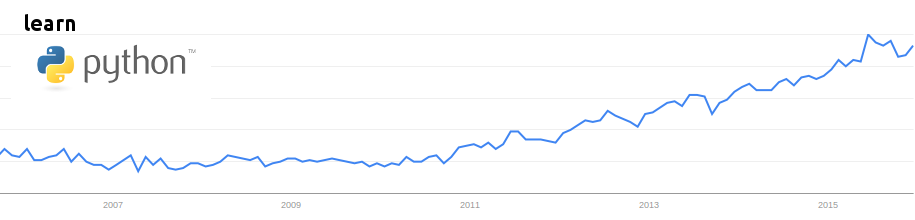

```{r setup, include=FALSE}
knitr::opts_chunk$set(echo = TRUE)
library('dplyr')
what.is.a.better.programming.language <- min
is.r.easy.to.learn <- function (x) {
  FALSE
}
is.it.worth.it.to.learn.r <- 'tbh prob not fam'
```


### Flaws And Problems in the R Programming Language, and why Python is Better

The R programming language has gaping issues that are elegantly solved in the Python programming language. If the goal of STAT 133 is to focus on Concepts of Computing with Data, as its title purports, R takes away much more often than it aides.

For the believers, mathematical at heart, I offer a one-line proof of my bodacious claim:

```{r}
what.is.a.better.programming.language('r', 'python')
```

For those skeptics, who have either not had the privilege of getting lost in the manual pages of one of the "_apply" functions, let's dive into why R is not the business, and python deserves your attention. For our first point:

## Is R Easy To Learn? A Syntactic Analysis
```{r}
is.r.easy.to.learn("vote on your phones!!1!!11one!")
```

The R programming language's learning curve is infamous in the data science world. One especially enlightened scientist, Tal Yarkoni, offers:

```{r}
"R gives you a certain amount of rope to work with. If you don’t know what you’re doing at all, you will most likely end up accidentally hanging yourself[.]"
```

Let's dive into why he would dare say such a thing. Good programming languages offer the programmer the ability to be clear, effective, and concise in their programs. They offer beautiful things such as uniformity. Let's give an example of a programming language that does this well. Oh I don't know, let's look at python perhaps.

#Indexing in Python

When indexing in python, there is one (1) indexing syntax. In python, regardless of if you're using a dictionary or a list, you use brackets to retrieve elements of the data structure. The same is the case for an arr- oh wait, an array is the same thing as a list in Python. Hm, maybe that could be our next point. Backtracking to our current criticism, let's show some examples of Python indexing:

Indexing with a python list:
```{python}
pythonIsTheBest = [0,2,4,6,8]
print(pythonIsTheBest[3])
```

Indexing with a python dictionary:
```{python}
pythonRulesRDrools = {"yes": "python rocks", "#1": ['p','y','t','h','o','n'], 0: "r"}
print(pythonRulesRDrools[0])
print(pythonRulesRDrools["yes"])
print(pythonRulesRDrools["#1"][0])
```
Notice in the above example that dictionaries can play the same role as a data frame in r.

#Indexing in R

Now, let's consider how we can index in R. I am a lazy programmer, as I was taught by my gurus, and will use the built in data frame "mtcars":

```{r}
structure(mtcars)

```

Let's see how many ways we can get to the miles per gallon, or mpg column of this data frame:

```{r}
mtcars[,1]
mtcars[,c('mpg')]
mtcars$mpg
mtcars[['mpg']]
mtcars[, (names(mtcars) %in% c('mpg'))]
subset(mtcars, select=c('mpg'))
select(mtcars, c('mpg'))
select(mtcars, mpg)
mtcars %>% select(mpg)
```
With R, the possibilities are endless! With R, your program can be Unique™, it doesn't have to look like anybody else's program. With R, you can make a repeated operation look different every single time with ease! There's no better way to confuse novice programmers than by adding a million different options for every basic operation. Or, if you want to make your program even more difficult to read for anyone who doesn't live in your head, R will work for you too!

In seriousness, indexing is one of, if not the most basic data analysis and manipulation tool. By including superfluous indexing options, R announces two things to beginners from the get-go. One, there will be multiple ways to go about doing every single operation in this language. And two, uniformity will not be a priority in this programming language.

These are two very worrying and dejecting messages to receive when starting in on a new programming language. And R does not fail to dissapoint. 

#Assignments in R

Another prime example of overcomplication is with assignments:

```{r}
this.is.valid <- TRUE
this.also.works <<- TRUE
so.does.this = TRUE
TRUE -> how.about.this
TRUE ->> even.this.is.allowed
```

Wow. The last time I saw such a bloated number of operators for one simple task was at the L&S Office of Undergraduate Advising. 


We have five (5) separate operators for the other most simple of simplistic operations in any programming language. The first operator evaluates the right side and binds it to the left. Great. We should be done here, but insteaaaaddddd

The second operator is called a scoping assignment. It evaluates the right hand side by looking in parent environments for relevant bindings. 

The third operator evaluates the right hand side and binds it to the left hand side. The use of this operator is frowned upon outside of function calls. Why you ask? Great Question! Moving on,

The fourth operator evaluates the left hand side and binds it to the right hand side. Really?
The fifth operator is called a scopin- wait, haven't I already wri- oh. Why is this necessary????

But wait, you might say, what if there's no better way?? What if we need all five (5)?? 

Well then, I might say, what if there was another programming language that did this better? With just ONE (1) operator? 

#Assignments in Python

Let's take a look at python's assignment operator(s):

```{python}
muchBetter = True
theWayThingsShouldBe = True
teachPythonInstead = True
soUniform = True
```

```{python}
try:
  True = noneOfThisSuperfluity
except NameError:
  print("this causes a NameError.")
```


As you get deeper into the language, the possible combinations of the different operators quickly causes divergence among all scripts written in R, creating another obstacle to programmers who want to learn the language: reading other people's programs.

An already daunting tasks, diving into another programmer's mind is one of the most often complained about tasks in the industry, however it is imperative in learning any language quickly. By building up this syntactic obstacle to clarity, R successfully impedes beginners' attempts to read scripts written by others.

#Conclusion of R's Syntax

In conclusion, R's syntax and plethora of options for uber-simple operations complicates more than it helps. As shown throughout this section, Python excels everywhere that R fails in this regard. Maybe that's why Python is gaining popularity so frequently:



A final point to consider in this argument is the fact that we are more than halfway through this course and a majority of our time has been spent learning R syntax. I propose that we would spend much less time if the language this class was taught in was python.

Also just a random thing that bugs me is allowing periods in variable names. Oh wait did I say random? I meant to say a transition into my next topic.

## Is it Worth it To Learn R? 

```{r}
is.it.worth.it.to.learn.r
```
Learning the R programming language is not conducive to learning other programming languages and only leads to a narrow area of application in industry.

Mr. Roger Peng, an R enthusiast and 18-year-long advocate admits that R is an "old technology in the way it was originally designed." Maybe it's outdated design explains its distance from almost any other programming language in common use today. For example, let's reopen the periods complaint. While every other programming language, from Python to Java to C++ to Javascript, uses periods to represent the accessing of a member of an object, r decides to just use it for variable names. Any student who learns r as a first programming language will get hit with confusion if they ever venture into a new language. And believe you me, there's no need to add even MORE ways to name variables. There's enough holy wars going on already:


Alienating decisions are made throughout the language. Let's highlight a few other key ones.

#A Language Without A Paradigm


R seems to be very indecisive about what programming paradigm it lives in. It's got a foot in functional programming and another foot in imperative programming.  This is a weakness and not a strength for two reasons. Firstly it makes learning and working in the language difficult. Secondly, once a programmer has learned how to program in R, the skills they learned are not transferable to working in other languages. While other languages make a very clear stance in what a paradigm they work in, R fails to cover multiple paradigms for no obvious benefit.

#A Language With Underdeveloped Types

The data types in R are aggressively limited, up to the point where it doesn't feel like a programming language at all. Other languages, such as Python, offer a much better variety of data types, and also offer more helpful errors when types are misused. On the other hand, R tends to fail silently or contort and bend the data to fit the situation. These approaches are unhelpful at best and debilitating at worst.

#A Language Unfit for the World Wide Web

Another issue with R is its lack of security. This is beyond the scope of this course, but I bring it up to point out that because of its security weakness, R is rarely run on the open web. Compare this with Python, which has a serious level of security and is used all over the internet. For students who want to be employable in companies that work with the internet, the choice is a no-brainer.


##Conclusion

Every computing class must choose a language to be taught in. However, the great classes realize that the language they choose is simply a medium towards an end goal: learning the syntax of a language is merely a means to an end. That end being lofty ideas such as artificial intelligence or efficient data storage. In this course, our lofty end goal is concepts in computing with data. We aim to analyze data, manipulate data, and learn to program. However, this course has been held back by the incessant demands of the R programming language. We spend too much time learning syntax when we should be learning overarching concepts.

During this post, I asked two questions: Is it easy to learn R, and Is it worth it to learn R. Those of you who have followed me here to the bottom of my post can surely agree that the answer to both questions is a resounding "NO". If this course were taught in Python, I believe that the two new questions I'd ask, Is it easy to learn Python, and Is it worth it to learn Python, the answers would be a resounding "YES". That would mean a more valuable course, and a better investment.

Thank you for your time,
Idan Hovav

Sources:
https://stat.ethz.ch/R-manual/R-devel/library/base/html/assignOps.html

https://www.infoworld.com/article/2940864/application-development/r-programming-language-statistical-data-analysis.html

https://www.quora.com/Whats-wrong-with-R-statistical-scripting-language-Can-these-problems-be-fixed-How

https://www.talyarkoni.org/blog/2012/06/08/r-the-master-troll-of-statistical-languages/comment-page-1/

https://readwrite.com/2013/11/25/python-displacing-r-as-the-programming-language-for-data-science/

https://www.r-bloggers.com/good-advice-for-security-with-r/

http://r4stats.com/2012/06/13/why-r-is-hard-to-learn/